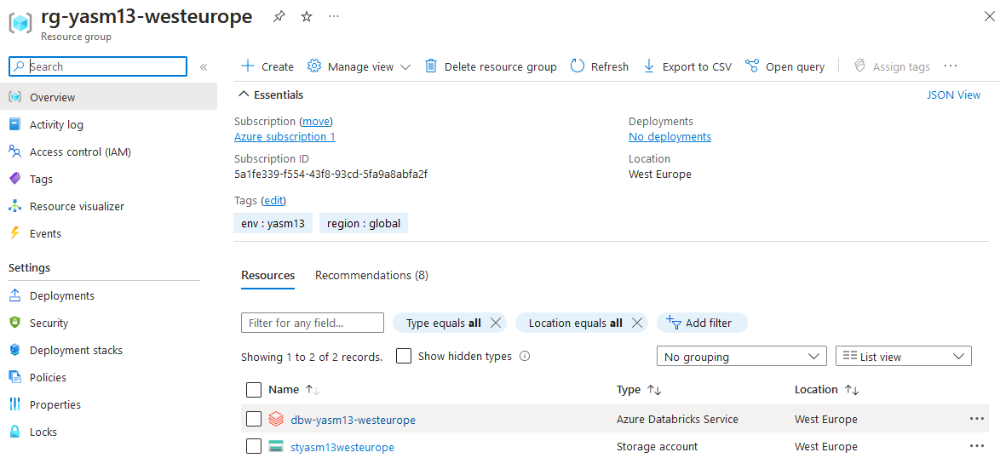
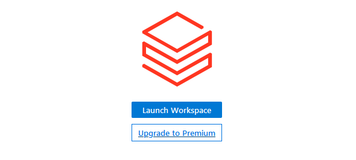
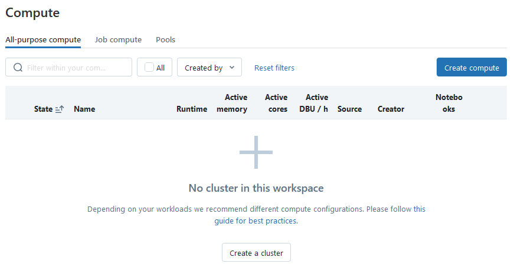
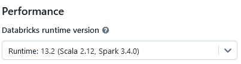
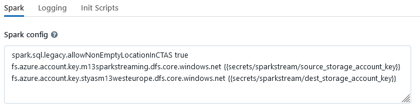
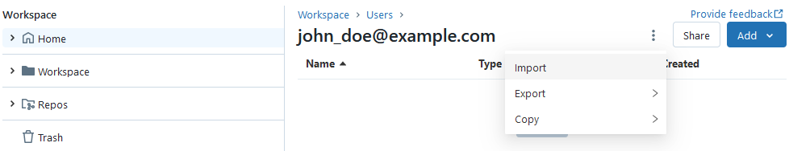
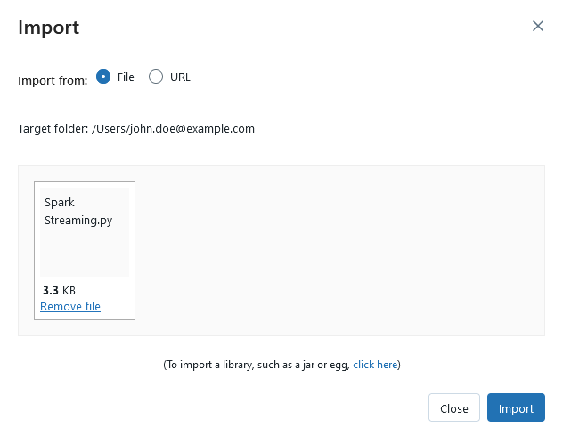
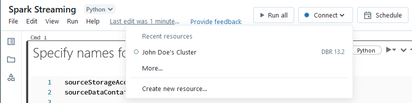
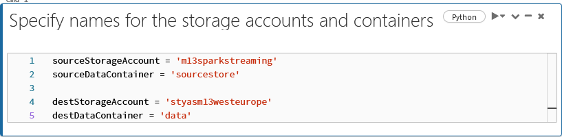

> **⚠ This guide assumes that all commands are executed from the repository root, if not stated otherwise**

# Prerequisites

1. Azure account with active subscription
2. Azure Data Lake Storage Gen2 (hierarchical) containing the source data (hotels and weather)
3. Bash-compatible environment such as WSL

## For launching the notebook in Azure

1. [Terraform CLI](https://developer.hashicorp.com/terraform/tutorials/azure-get-started/install-cli)
2. [Azure CLI](https://learn.microsoft.com/en-us/cli/azure/install-azure-cli-linux?pivots=apt)
3. [Databricks CLI](https://learn.microsoft.com/en-us/azure/databricks/dev-tools/cli/databricks-cli)

## For launching the local Spark app (optional)

1. Python >= 3.8
2. `pip`

# Running the notebook

1. Create the infrastructure 
    - Make `create-azure-env.sh` script executable. To do this, run
        ```sh
        chmod +x create-azure-env.sh
        ```
    - Run the script:
        ```sh
        ./create-azure-env.sh
        ```
    During the execution, the script will ask for 3 inputs:
    1. Azure region: name of Azure location to create all of the resources, including Terraform state
    2. Prefix for the resources: unique prefix which will be prepended to the names of the resources created by this script
    3. Prior to creating the infrastructure, Terraform will ask you if you want to apply it. Please type "`yes`":
        ```
        Do you want to perform these actions?
          Terraform will perform the actions described above.
          Only 'yes' will be accepted to approve.

         Enter a value: yes
        ```

2. Check that your Databricks workspace has been created:
    - Go to Azure Portal
    - Open the resource group containing Azure Databricks Service resource. The group's name will have the following format: `rg-<your prefix>-<azure location>`:

        

    - Go to Azure Databricks Service and open the workspace by clicking "Launch Workspace" button:

        

3. Create Databricks secrets
    - In your home directory, create `.databrickscfg` file if doesn't exist yet:
        ```
        touch ~/.databrickscfg
        ```
    - Add to the file a section for your workspace URL:
        ```
        [sparkstream]
        host = https://adb-7125499339010867.7.azuredatabricks.net

        ```
    - Create secrets scope for your workspace:
        ```
        databricks secrets create-scope sparkstream --initial-manage-principal users -p sparkstream
        ``` 
    - Get access key for the storage account containing source dataset
    - Create a secret for that access key:
        ```
        databricks secrets put-secret sparkstream source_storage_account_key -p sparkstream
        ```
        Please enter the key when Databricks CLI will ask for it ("Please enter your secret value:")
    - Get access key for the storage account where resulting data will be saved. You can do this either from Azure Portal or by invoking Terraform:
        ```
        terraform -chdir=terraform output -raw storage_account_access_key
        ```
    - Create a secret for that access key:
        ```
        databricks secrets put-secret sparkstream dest_storage_account_key -p sparkstream
        ```

4. Create cluster in Databricks
    - Open Databricks Workspace
    - From the left menu, go to "Compute" page
    - Press "Create compute" button in the upper-right corner:

        

    - Provide the data required by Databricks for cluster template. For "Databricks runtime version", please choose:

        

    - Open "Advanced options". Add the following lines to "Spark config" input:
        ```
        spark.sql.legacy.allowNonEmptyLocationInCTAS true
        fs.azure.account.key.<src_storage_account>.dfs.core.windows.net {{secrets/sparkstream/source_storage_account_key}}
        fs.azure.account.key.<dest_storage_account>.dfs.core.windows.net {{secrets/sparkstream/dest_storage_account_key}}
        ```
        Here, `<src_storage_account>` is the name of the storage account with source datasets. 
        `<dest_storage_account>` is the name of the storage account where resulting data will be saved.
        
        

    - Press "Create Cluster" and wait till it's initialized

5. Import the notebook
    - In Databricks Workspace, go to "Workspace" page
    - Choose "Home" tab
    - In the upper-right corner, press **⫶** button and choose "Import":

        

    - Use the dialog to upload the notebook for this exercise (it's in "notebooks" directory of this repo). Then press "Import":

        

    - Open the notebook from the list

6. Running the notebook 
    - Connect the notebook to the cluster:

        

    - Set proper values for the variables - names for source and destination storage accounts and containers:

        

    - Press "Run all"

# [Optional] Running the local Spark app to incrementally copy the dataset to destination container

1. Install project dependencies:
    ```sh
    pip install -r requirements.txt
    ```

2. Set env variables
    - Open `spark.env` file and set values for the variables inside
    - Save the file

2. Run the program:
    ```
    env $(cat spark.env | xargs) python3 src/main/python/incremental_loader.py
    ```